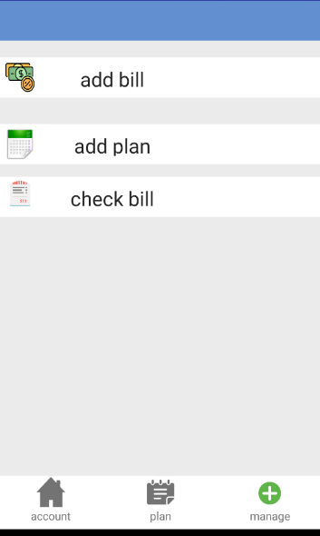
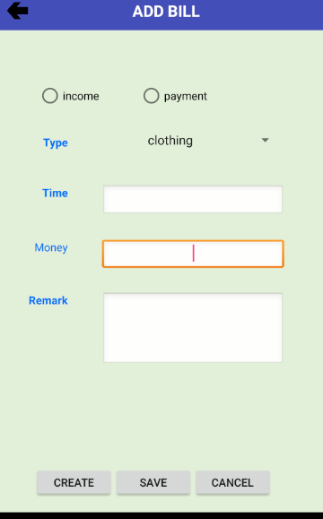
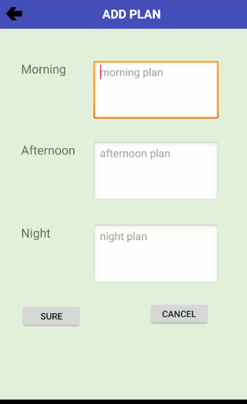
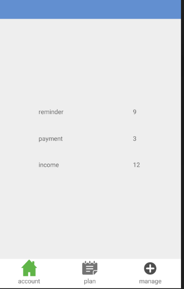

# AccountProject

The app has three main fuction 1.add bill 2.add plan 3.check bills 
if you want to add a bill you should click manage and add bill ,

if you want to add a plan you can click add plan  you also can check the plan 

last you can  check the bill 

There is a account in main interface

